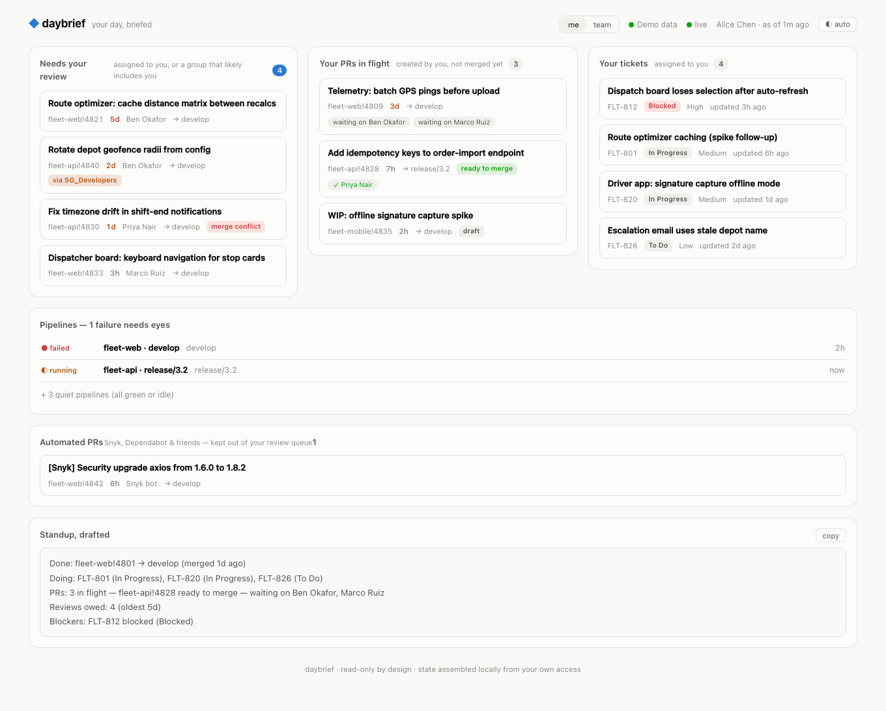
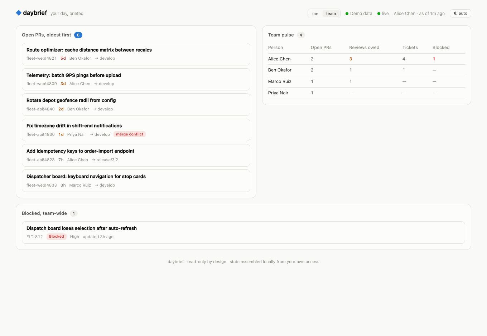

#  daybrief

[](https://github.com/ajitjha393/daybrief/actions/workflows/ci.yml)

**Your day, briefed.** A read-only morning dashboard for teams living on
**Azure DevOps + Jira + Bitbucket** — the stack every enterprise team runs and
every dev tool ignores.

One screen answers the question you currently assemble by hand across four
tabs: **what needs me today?**

<picture>
  <source media="(prefers-color-scheme: dark)" srcset="docs/screenshot-dark.png">
  
</picture>

## Try it in 10 seconds (no credentials)

```sh
npx daybrief --mock
```

That's the real UI on demo data. When it looks like something your mornings
want, wire it to your org:

```sh
npx daybrief init     # writes daybrief.json — fill in org, projects, who you are
npx daybrief          # polls, serves, opens your brief
```

## What's on the screen

- **Needs your review** — PRs where your vote is still missing, *oldest first*,
  with age escalating from quiet to loud. Review debt becomes visible without
  anyone nagging anyone.
- **Your PRs in flight** — who each one is waiting on, approvals so far,
  merge-conflict flags, and a green *ready to merge* when it's truly unblocked.
- **Your tickets** — open Jira work, blocked items floated to the top.
- **Pipelines** — latest run per pipeline, failures first; the green wall
  collapses behind a count instead of demanding a scroll.
- **Group reviews** — ADO teams often assign PRs to a group (`SG_Developers`)
  instead of people. daybrief surfaces those in your review lane when the repo
  is one you're demonstrably active in (or listed in `groupReviewRepos`),
  marked *via group* so you know it's a softer signal.
- **Standup, drafted** — a copy-pasteable summary at the bottom: what you're
  working on, PRs in flight and who they wait on, reviews you owe — and a
  Blockers line **only when something is genuinely blocked**.
- **Team view** (`#team`) — the radiator: every open PR oldest-first, a
  per-person pulse (open PRs / reviews owed / tickets / blocked — counts,
  never rankings), and blocked work team-wide.

<picture>
  <source media="(prefers-color-scheme: dark)" srcset="docs/screenshot-dark.png">
  
</picture>

Updates stream in live (SSE); long lists render progressively as you scroll;
a provider having a bad moment shows its error in the header while its last
good data stays on the board.

## The morning digest

```sh
npx daybrief digest --dry-run   # preview
npx daybrief digest             # post to your channel webhook (cron-friendly)
```

With a `digest` block in the config, the server posts it daily at `digest.at`
— daybrief for the people who'll never open a dashboard. The webhook URL is a
secret: `DAYBRIEF_WEBHOOK_URL` env var or the secrets file.

## The stack nobody builds for

GitHub teams get `gh dash`, Graphite, and a hundred pretty radiators. Teams on
Azure DevOps and Jira get… in-product dashboards from 2014, none of which can
see across the ADO↔Jira seam. daybrief exists for that seam: code review state
and build state live in ADO/Bitbucket, work state lives in Jira, and your
morning question spans all three.

## Design promises

1. **Read-only, by construction.** daybrief holds no write scopes and sends
   no mutations — it cannot approve, merge, transition, or comment. The worst
   it can do is show you the truth.
2. **No metrics theater.** No velocity, no leaderboards, no per-person
   charts. daybrief shows *state that needs action*, not performance. That
   line is what keeps a team radiator trusted instead of resented, and it's
   permanent.
3. **Your credentials stay yours.** Secrets come from env vars referenced by
   name in the config; the dashboard is served on localhost; state lives in
   process memory. Nothing is persisted, proxied, or phoned home.

## Configuration

`daybrief.json` (structure only — committable):

```jsonc
{
  "me": { "name": "Alice", "ado": "alice@co.com", "jira": "alice@co.com", "bitbucket": "alice-dev" },
  "pollSeconds": 90,
  "ado": {
    "org": "yourorg", "projects": ["Fleet"], "repos": [], "auth": "az",
    "excludePipelines": ["-Android", "-iOS"],      // substring filters for noisy farms
    "groupReviewRepos": ["Web.App"]                 // repos where SG_* groups mean "maybe me"
  },
  "jira": {
    "site": "yourorg.atlassian.net",
    "jql": null,                                     // default: your open work (+ recent done)
    "teamJql": "project = FLT AND sprint in openSprints()",  // extra fetch for the team view
    "includeStatuses": ["Pending Deployment"]        // done-category states to keep on the board
  },
  "bitbucket": { "workspace": "yourws", "repos": ["mobile-app"] }
}
```

| Provider | Auth | Notes |
|---|---|---|
| Azure DevOps | `"auth": "az"` → your existing `az login` (zero setup) · `"auth": "pat"` → `ADO_PAT` | PRs + reviewer votes + latest run per pipeline |
| Jira | `JIRA_EMAIL` + `JIRA_API_TOKEN` (an [API token](https://id.atlassian.com/manage-profile/security/api-tokens), never your password) | your JQL or a sane personal default; blocked = blocked-ish status or `blocked` label |
| Bitbucket | `BITBUCKET_USER` + `BITBUCKET_APP_PASSWORD` | open PRs with reviewers (per-PR detail on the newest slice) |

**Prefer a file over env vars?** Drop a `daybrief.secrets.json` next to the
config (the starter `.gitignore` already excludes it — never commit it):

```json
{
  "jira": { "email": "alice@co.com", "token": "your-atlassian-api-token" },
  "ado": { "pat": "only-if-not-using-az" },
  "bitbucket": { "user": "alice-dev", "appPassword": "…" }
}
```

Env vars still win when both are present, so CI and power-user setups keep
working unchanged.

Every external payload is validated with [zod](https://zod.dev) at the
boundary; the codebase is strict TypeScript with `no-explicit-any` enforced as
a lint **error** — fields a source doesn't expose stay `null` and render as
unknown, never guessed.

## Roadmap

- **v0.5** — release radar: branch drift, pending cherry-picks across `release/*`, "merged to develop but not release" alerts
- **v0.6** — desktop notifications with per-item snooze/ack · Bitbucket pipelines
- **later** — GitHub/GitLab providers · deployable radiator (Docker + auth)

## Development

```sh
git clone https://github.com/ajitjha393/daybrief && cd daybrief
npm ci
npm run dev        # compiles the server, boots on demo data
npm run dev:web    # vite dev server with /api proxied
npm test           # vitest
```

Server: Node ≥20, strict TS compiled to `dist/`, zod as the only runtime
dependency. Web: React 19 + Vite, prebuilt into the package so `npx daybrief`
installs one dependency and no toolchain.

## License

MIT
